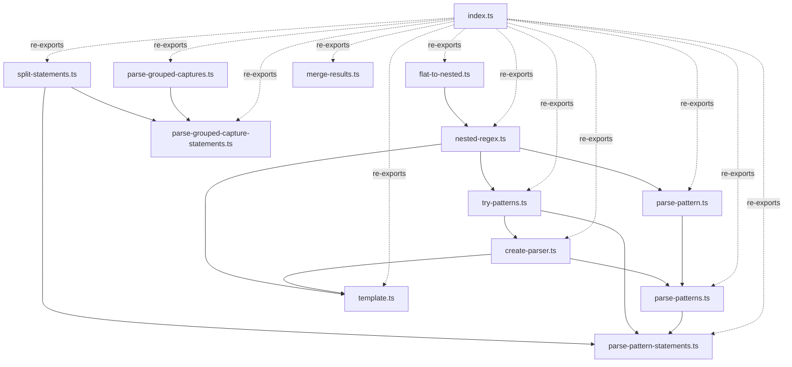

# Design Document: Modular Exports

## Overview

This design implements modular exports for the nested-regex-groups library, enabling users to import individual functions via subpath exports. The primary goal is to support buildless environments where tree-shaking is unavailable, allowing developers to load only the code they need.

The design organizes the existing monolithic `index.ts` into focused modules based on:
- **Dependency relationships**: Functions with shared dependencies are grouped together
- **Usage patterns**: Commonly co-used functions are kept in the same module
- **Zero-dependency isolation**: Standalone utilities are separated for minimal imports

All modules will be exposed through package.json subpath exports with clean, kebab-case import paths like `nested-regex-groups/split-statements`.

## Architecture

### Module Organization Strategy

The library will be split into the following module categories:

1. **Core Utilities** (zero dependencies)
   - `flat-to-nested.ts`: Converts dot-notation keys to nested objects
   - `merge-results.ts`: Merges multiple parse results

2. **Statement Processing** (minimal dependencies)
   - `split-statements.ts`: Splits paragraphs into statements (zero dependencies)

3. **Core Parsing** (builds on utilities)
   - `nested-regex.ts`: Core parser with dot notation support (depends on flat-to-nested)
   - `try-patterns.ts`: Multi-pattern matching (depends on nested-regex)
   - `create-parser.ts`: Parser factory (depends on try-patterns)

4. **Runtime Pattern Parsing** (for JSON configs)
   - `parse-pattern.ts`: Single pattern from string (depends on nested-regex)
   - `parse-patterns.ts`: Multiple patterns from config (depends on create-parser, parse-pattern)

5. **Flat Group Parsing** (no nesting)
   - `parse-grouped-captures.ts`: Single statement flat parsing (zero library dependencies)
   - `parse-grouped-capture-statements.ts`: Multi-statement flat parsing (depends on split-statements, parse-grouped-captures)

6. **Nested Statement Parsing** (full nesting support)
   - `parse-pattern-statements.ts`: Multi-statement nested parsing (depends on split-statements, parse-patterns, try-patterns)
   - Exports `parseParagraph` as an alias

7. **Template Tags** (existing)
   - `template.ts`: Template tag API (depends on nested-regex, create-parser)

8. **Barrel Export**
   - `index.ts`: Re-exports all functions from modules

### Dependency Graph



### Import Path Conventions

All subpath exports follow the pattern: `nested-regex-groups/{module-name}`

- Module names use kebab-case
- Match the filename without extension
- Examples:
  - `nested-regex-groups/split-statements`
  - `nested-regex-groups/nested-regex`
  - `nested-regex-groups/parse-pattern-statements`

## Components and Interfaces

### 1. Core Utility Modules

#### `flat-to-nested.ts`

**Purpose**: Convert flat objects with dot-notation keys to nested structures

**Exports**:
```typescript
export function flatToNested(groups: Record<string, string | undefined>): any
```

**Dependencies**: None

**Internal Helpers**: None (all logic inline)

---

#### `merge-results.ts`

**Purpose**: Merge multiple parse results into a single object

**Exports**:
```typescript
export function mergeResults<T = any>(results: ParseResult[]): T | null
```

**Dependencies**: 
- Types from `types/nested-regex-groups/types.js`

**Internal Helpers**: None

---

### 2. Statement Processing Module

#### `split-statements.ts`

**Purpose**: Split paragraphs into individual statements

**Exports**:
```typescript
export function splitStatements(input: string): string[]
```

**Dependencies**: None

**Internal Helpers**: None (all logic inline)

**Rules**:
- Splits on `.` followed by whitespace or end of string
- Ignores `?.` (optional chaining)
- Ignores `\.` (escaped period)

---

### 3. Core Parsing Modules

#### `nested-regex.ts`

**Purpose**: Core parser with dot notation support

**Exports**:
```typescript
export function nestedRegex<T = any>(
  pattern: RegExp,
  options?: NestedRegexOptions
): (input: string) => ParseResult<T>
```

**Dependencies**:
- `flatToNested` from `./flat-to-nested.js`
- Types from `types/nested-regex-groups/types.js`

**Internal Helpers**:
```typescript
function applyGroupMap(
  groups: Record<string, string | undefined>,
  groupMap?: Record<string, string>
): Record<string, string | undefined>
```

**Design Decision**: `applyGroupMap` remains internal (not exported) as it's only used by `nestedRegex` and has no standalone value.

---

#### `try-patterns.ts`

**Purpose**: Try multiple patterns and return first match

**Exports**:
```typescript
export function tryPatterns<T = any>(
  input: string,
  patterns: ParsePattern[],
  options?: ParserOptions
): ParseResult<T> & { pattern?: string }
```

**Dependencies**:
- `nestedRegex` from `./nested-regex.js`
- Types from `types/nested-regex-groups/types.js`

**Internal Helpers**: None

---

#### `create-parser.ts`

**Purpose**: Factory for creating parser functions

**Exports**:
```typescript
export function createParser<T = any>(
  patterns: ParsePattern[],
  options?: ParserOptions
): (input: string) => ParseResult<T> & { pattern?: string }
```

**Dependencies**:
- `tryPatterns` from `./try-patterns.js`
- Types from `types/nested-regex-groups/types.js`

**Internal Helpers**: None

---

### 4. Runtime Pattern Parsing Modules

#### `parse-pattern.ts`

**Purpose**: Parse regex pattern strings with dot notation

**Exports**:
```typescript
export function parsePattern<T = any>(
  patternString: string,
  name?: string
): (input: string) => ParseResult<T>
```

**Dependencies**:
- `nestedRegex` from `./nested-regex.js`
- Types from `types/nested-regex-groups/types.js`

**Internal Helpers**: None (group extraction logic inline)

---

#### `parse-patterns.ts`

**Purpose**: Parse multiple pattern configs from JSON

**Exports**:
```typescript
export function parsePatterns<T = any>(
  patternConfigs: PatternConfig[],
  options?: ParserOptions
): (input: string) => ParseResult<T> & { pattern?: string }
```

**Dependencies**:
- `createParser` from `./create-parser.js`
- Types from `types/nested-regex-groups/types.js`

**Internal Helpers**:
```typescript
function convertToPatternsWithGroupMap(
  patternConfigs: PatternConfig[]
): ParsePattern[]
```

**Design Decision**: `convertToPatternsWithGroupMap` is extracted as a shared helper since it's used by both `parsePatterns` and `parsePatternStatements`. It will be exported from `parse-patterns.ts` for reuse.

---

### 5. Flat Group Parsing Modules

#### `parse-grouped-captures.ts`

**Purpose**: Parse single statement with flat groups (no nesting)

**Exports**:
```typescript
export function parseGroupedCaptures<T = any>(
  input: string,
  patternConfigs: PatternConfig[],
  options?: ParserOptions
): ParseResult<T> & { pattern?: string }
```

**Dependencies**:
- Types from `types/nested-regex-groups/types.js`

**Internal Helpers**: None

**Note**: This function does NOT use `nestedRegex` - it works directly with standard regex groups.

---

#### `parse-grouped-capture-statements.ts`

**Purpose**: Parse multiple statements with flat groups

**Exports**:
```typescript
export function parseGroupedCaptureStatements<T = any>(
  input: string,
  patternConfigs: PatternConfig[],
  options?: ParserOptions
): StatementsResult<T>
```

**Dependencies**:
- `splitStatements` from `./split-statements.js`
- `parseGroupedCaptures` from `./parse-grouped-captures.js`
- Types from `types/nested-regex-groups/types.js`

**Internal Helpers**: None

---

### 6. Nested Statement Parsing Module

#### `parse-pattern-statements.ts`

**Purpose**: Parse multiple statements with nested groups

**Exports**:
```typescript
export function parsePatternStatements<T = any>(
  input: string,
  patternConfigs: PatternConfig[],
  options?: ParserOptions
): StatementsResult<T>

export const parseParagraph = parsePatternStatements
```

**Dependencies**:
- `splitStatements` from `./split-statements.js`
- `tryPatterns` from `./try-patterns.js`
- `convertToPatternsWithGroupMap` from `./parse-patterns.js`
- Types from `types/nested-regex-groups/types.js`

**Internal Helpers**: None (uses shared `convertToPatternsWithGroupMap`)

---

### 7. Template Tag Module

#### `template.ts`

**Purpose**: Template tag API for regex patterns

**Exports**:
```typescript
export function rx<T = any>(
  strings: TemplateStringsArray,
  ...values: any[]
): (input: string) => ParseResult<T>

export function rxPattern(
  name: string,
  description?: string
): (strings: TemplateStringsArray, ...values: any[]) => ParsePattern

export function rxParser<T = any>(
  patterns: ParsePattern[],
  options?: ParserOptions
): (input: string) => ParseResult<T> & { pattern?: string }
```

**Dependencies**:
- `nestedRegex` from `./nested-regex.js`
- `createParser` from `./create-parser.js`
- Types from `types/nested-regex-groups/types.js`

**Internal Helpers**:
```typescript
function extractGroups(pattern: string): { original: string; sanitized: string }[]
function sanitizePattern(pattern: string): string
function createGroupMap(groups: { original: string; sanitized: string }[]): Record<string, string>
```

**Changes**: Update imports to use new module paths instead of `./index.js`

---

### 8. Barrel Export

#### `index.ts`

**Purpose**: Re-export all functions for backward compatibility

**Structure**:
```typescript
// Re-export types
export type { ... } from './types/nested-regex-groups/types.js';

// Re-export utilities
export { flatToNested } from './flat-to-nested.js';
export { mergeResults } from './merge-results.js';

// Re-export statement processing
export { splitStatements } from './split-statements.js';

// Re-export core parsing
export { nestedRegex } from './nested-regex.js';
export { tryPatterns } from './try-patterns.js';
export { createParser } from './create-parser.js';

// Re-export runtime pattern parsing
export { parsePattern } from './parse-pattern.js';
export { parsePatterns } from './parse-patterns.js';

// Re-export flat group parsing
export { parseGroupedCaptures } from './parse-grouped-captures.js';
export { parseGroupedCaptureStatements } from './parse-grouped-capture-statements.js';

// Re-export nested statement parsing
export { parsePatternStatements, parseParagraph } from './parse-pattern-statements.js';
```

**Dependencies**: All module files

**Note**: Does NOT re-export internal helpers like `applyGroupMap` or `convertToPatternsWithGroupMap`

## Data Models

### Type Definitions

All types remain in `types/nested-regex-groups/types.d.ts` and are imported by modules as needed:

```typescript
export interface ParseSuccess<T = any> {
  success: true;
  value: T;
  matched: string;
  rest: string;
}

export interface ParseFailure {
  success: false;
  error: string;
  position: number;
}

export type ParseResult<T = any> = ParseSuccess<T> | ParseFailure;

export interface ParsePattern {
  name: string;
  regex: RegExp;
  groupMap?: Record<string, string>;
  description?: string;
}

export interface PatternConfig {
  name: string;
  pattern: string;
  description?: string;
}

export interface NestedRegexOptions {
  name?: string;
  groupMap?: Record<string, string>;
}

export interface ParserOptions {
  verbose?: boolean;
}

export interface StatementsResult<T = any> {
  success: boolean;
  statements: Array<{
    pattern?: string;
    value?: T;
    matched?: string;
    error?: string;
  }>;
}
```

### Module File Structure

```
nested-regex-groups/
├── index.ts                                  # Barrel export
├── index.d.ts                                # Generated types
├── template.ts                               # Template tags (existing)
├── template.d.ts                             # Generated types
├── flat-to-nested.ts                         # NEW
├── flat-to-nested.d.ts                       # Generated
├── merge-results.ts                          # NEW
├── merge-results.d.ts                        # Generated
├── split-statements.ts                       # NEW
├── split-statements.d.ts                     # Generated
├── nested-regex.ts                           # NEW
├── nested-regex.d.ts                         # Generated
├── try-patterns.ts                           # NEW
├── try-patterns.d.ts                         # Generated
├── create-parser.ts                          # NEW
├── create-parser.d.ts                        # Generated
├── parse-pattern.ts                          # NEW
├── parse-pattern.d.ts                        # Generated
├── parse-patterns.ts                         # NEW
├── parse-patterns.d.ts                       # Generated
├── parse-grouped-captures.ts                 # NEW
├── parse-grouped-captures.d.ts               # Generated
├── parse-grouped-capture-statements.ts       # NEW
├── parse-grouped-capture-statements.d.ts     # Generated
├── parse-pattern-statements.ts               # NEW
├── parse-pattern-statements.d.ts             # Generated
├── types/
│   └── nested-regex-groups/
│       └── types.d.ts                        # Shared types (existing)
└── package.json                              # Updated exports
```

## Package.json Exports Configuration

```json
{
  "exports": {
    ".": {
      "types": "./index.d.ts",
      "import": "./index.js"
    },
    "./template": {
      "types": "./template.d.ts",
      "import": "./template.js"
    },
    "./flat-to-nested": {
      "types": "./flat-to-nested.d.ts",
      "import": "./flat-to-nested.js"
    },
    "./merge-results": {
      "types": "./merge-results.d.ts",
      "import": "./merge-results.js"
    },
    "./split-statements": {
      "types": "./split-statements.d.ts",
      "import": "./split-statements.js"
    },
    "./nested-regex": {
      "types": "./nested-regex.d.ts",
      "import": "./nested-regex.js"
    },
    "./try-patterns": {
      "types": "./try-patterns.d.ts",
      "import": "./try-patterns.js"
    },
    "./create-parser": {
      "types": "./create-parser.d.ts",
      "import": "./create-parser.js"
    },
    "./parse-pattern": {
      "types": "./parse-pattern.d.ts",
      "import": "./parse-pattern.js"
    },
    "./parse-patterns": {
      "types": "./parse-patterns.d.ts",
      "import": "./parse-patterns.js"
    },
    "./parse-grouped-captures": {
      "types": "./parse-grouped-captures.d.ts",
      "import": "./parse-grouped-captures.js"
    },
    "./parse-grouped-capture-statements": {
      "types": "./parse-grouped-capture-statements.d.ts",
      "import": "./parse-grouped-capture-statements.js"
    },
    "./parse-pattern-statements": {
      "types": "./parse-pattern-statements.d.ts",
      "import": "./parse-pattern-statements.js"
    }
  },
  "files": [
    "index.js",
    "index.d.ts",
    "template.js",
    "template.d.ts",
    "flat-to-nested.js",
    "flat-to-nested.d.ts",
    "merge-results.js",
    "merge-results.d.ts",
    "split-statements.js",
    "split-statements.d.ts",
    "nested-regex.js",
    "nested-regex.d.ts",
    "try-patterns.js",
    "try-patterns.d.ts",
    "create-parser.js",
    "create-parser.d.ts",
    "parse-pattern.js",
    "parse-pattern.d.ts",
    "parse-patterns.js",
    "parse-patterns.d.ts",
    "parse-grouped-captures.js",
    "parse-grouped-captures.d.ts",
    "parse-grouped-capture-statements.js",
    "parse-grouped-capture-statements.d.ts",
    "parse-pattern-statements.js",
    "parse-pattern-statements.d.ts",
    "types/nested-regex-groups/types.d.ts",
    "README.md",
    "LICENSE"
  ]
}
```

## Migration Strategy

### Phase 1: Extract Modules

1. Create new module files in the root directory
2. Move functions from `index.ts` to their respective modules
3. Update imports within each module to use relative paths with `.js` extensions
4. Ensure each module imports only what it needs

### Phase 2: Update Barrel Export

1. Replace function implementations in `index.ts` with re-exports
2. Maintain all existing exports for backward compatibility
3. Keep type re-exports at the top

### Phase 3: Update Template Module

1. Change `template.ts` imports from `./index.js` to specific module paths:
   - `./nested-regex.js` for `nestedRegex`
   - `./create-parser.js` for `createParser`
2. Keep internal helper functions unchanged

### Phase 4: Update Package Configuration

1. Add subpath exports to `package.json`
2. Add all new `.js` and `.d.ts` files to the `files` array
3. Verify TypeScript compilation generates correct `.d.ts` files

### Phase 5: Testing

1. Run existing test suite to ensure no regressions
2. Add tests for subpath imports
3. Test in buildless environment (browser without bundler)
4. Verify tree-shaking still works in bundled environments

### Backward Compatibility Guarantees

- All existing imports from `nested-regex-groups` continue to work
- All existing imports from `nested-regex-groups/template` continue to work
- Function signatures remain identical
- Type exports remain identical
- No breaking changes to public API

### Migration Examples for Users

**Before (still works)**:
```typescript
import { splitStatements, parsePatternStatements } from 'nested-regex-groups';
```

**After (selective import)**:
```typescript
import { splitStatements } from 'nested-regex-groups/split-statements';
import { parsePatternStatements } from 'nested-regex-groups/parse-pattern-statements';
```

**Buildless environment benefit**:
```html
<script type="module">
  // Only loads split-statements.js (no dependencies)
  import { splitStatements } from './node_modules/nested-regex-groups/split-statements.js';
  
  const statements = splitStatements('First. Second. Third.');
  console.log(statements); // ['First', 'Second', 'Third']
</script>
```

## Error Handling

### Module Loading Errors

**Scenario**: User imports from non-existent subpath

**Handling**: Node.js and browsers will throw a module resolution error with clear message indicating the path doesn't exist

**Prevention**: Document all available subpaths in README

### Circular Dependency Prevention

**Strategy**: 
- Organize modules in dependency layers (utilities → core → high-level)
- Never import from higher layers into lower layers
- Use shared helper exports when needed (e.g., `convertToPatternsWithGroupMap`)

**Validation**: 
- Run `madge` or similar tool to detect circular dependencies
- Add CI check to prevent circular dependencies

### Type Resolution Errors

**Scenario**: TypeScript can't find types for subpath import

**Handling**: Ensure each module has corresponding `.d.ts` file and package.json exports include `types` field

**Prevention**: 
- TypeScript compiler generates `.d.ts` files automatically
- Test type imports in TypeScript project

## Testing Strategy

### Unit Tests

**Existing tests**: All existing tests in `index.test.ts` and `template.test.ts` must pass without modification

**New tests**:
1. **Module isolation tests**: Import each module independently and verify it works
2. **Subpath import tests**: Test importing from each subpath export
3. **Dependency chain tests**: Verify modules only load their declared dependencies

**Example test structure**:
```typescript
// Test: split-statements module works standalone
import { splitStatements } from '../split-statements.js';

test('splitStatements works as standalone import', () => {
  const result = splitStatements('First. Second.');
  expect(result).toEqual(['First', 'Second']);
});

// Test: nested-regex depends only on flat-to-nested
import { nestedRegex } from '../nested-regex.js';

test('nestedRegex works with minimal dependencies', () => {
  const parser = nestedRegex(/^(?<user_name>\w+)$/, {
    groupMap: { user_name: 'user.name' }
  });
  const result = parser('john');
  expect(result.success).toBe(true);
  expect(result.value).toEqual({ user: { name: 'john' } });
});
```

### Integration Tests

1. **Barrel export test**: Verify all functions are re-exported from `index.js`
2. **Template module test**: Verify template.js works with new module structure
3. **Buildless environment test**: Load modules in browser without bundler

### Backward Compatibility Tests

1. **Import compatibility**: Test that all existing import patterns still work
2. **Function signature compatibility**: Verify no changes to function behavior
3. **Type compatibility**: Ensure TypeScript types are identical

### Performance Tests

1. **Load time comparison**: Measure load time of selective imports vs barrel import
2. **Bundle size comparison**: Compare bundle sizes in buildless environment

**Expected results**:
- Selective import of `splitStatements` should load ~1KB vs ~15KB for full library
- No performance regression for users importing from barrel export

## TypeScript Configuration

### No Changes Required

The existing `tsconfig.json` is already configured correctly:
- `module: "ESNext"` supports ES modules
- `declaration: true` generates `.d.ts` files
- `outDir: "."` places compiled files in root (alongside source files)

### Type Generation

TypeScript will automatically generate `.d.ts` files for each `.ts` module:
- `flat-to-nested.ts` → `flat-to-nested.d.ts`
- `nested-regex.ts` → `nested-regex.d.ts`
- etc.

### Type Re-exports

Each module will import and re-export types as needed:

```typescript
// In nested-regex.ts
import type { ParseResult, NestedRegexOptions } from './types/nested-regex-groups/types.js';

export function nestedRegex<T = any>(
  pattern: RegExp,
  options?: NestedRegexOptions
): (input: string) => ParseResult<T> {
  // ...
}
```

The generated `.d.ts` file will include these type references automatically.

## Design Decisions Summary

### 1. Module Grouping

**Decision**: Group functions by dependency relationships and usage patterns

**Rationale**: 
- Minimizes import chains in buildless environments
- Keeps commonly co-used functions together
- Isolates zero-dependency utilities for minimal imports

**Alternatives considered**:
- One function per file: Too granular, creates many small files
- Fewer larger modules: Reduces benefits of selective imports

### 2. Internal Helper Functions

**Decision**: Keep `applyGroupMap` internal to `nested-regex.ts`, export `convertToPatternsWithGroupMap` from `parse-patterns.ts`

**Rationale**:
- `applyGroupMap` is only used by `nestedRegex` and has no standalone value
- `convertToPatternsWithGroupMap` is reused by `parsePatternStatements`, so it should be exported
- Reduces API surface area while enabling code reuse

**Alternatives considered**:
- Export all helpers: Clutters API with low-level functions
- Duplicate helper code: Violates DRY principle

### 3. Import Path Naming

**Decision**: Use kebab-case matching filename without extension

**Rationale**:
- Consistent with common JavaScript conventions
- Easy to remember (matches filename)
- Readable in import statements

**Alternatives considered**:
- camelCase: Less common for import paths
- Descriptive names different from filenames: Harder to remember

### 4. Circular Dependency Prevention

**Decision**: Organize modules in strict dependency layers

**Rationale**:
- Prevents circular dependencies that break ES modules
- Makes dependency graph easy to understand
- Enables efficient tree-shaking

**Strategy**:
```
Layer 1 (utilities): flat-to-nested, merge-results, split-statements
Layer 2 (core): nested-regex, parse-grouped-captures
Layer 3 (patterns): try-patterns, parse-pattern
Layer 4 (factories): create-parser, parse-patterns
Layer 5 (statements): parse-grouped-capture-statements, parse-pattern-statements
Layer 6 (template): template
Layer 7 (barrel): index
```

### 5. Shared Utility Exports

**Decision**: Export `convertToPatternsWithGroupMap` from `parse-patterns.ts` for reuse

**Rationale**:
- Avoids code duplication between `parsePatterns` and `parsePatternStatements`
- Keeps the helper close to its primary use case
- Allows `parsePatternStatements` to import it without creating circular dependency

**Implementation**:
```typescript
// In parse-patterns.ts
export function convertToPatternsWithGroupMap(
  patternConfigs: PatternConfig[]
): ParsePattern[] {
  // ... implementation
}

// In parse-pattern-statements.ts
import { convertToPatternsWithGroupMap } from './parse-patterns.js';
```

### 6. Template Module Updates

**Decision**: Update `template.ts` to import from specific modules instead of barrel export

**Rationale**:
- Avoids circular dependency (template → index → template)
- Demonstrates best practice for internal imports
- Reduces load time for template module users

**Changes**:
```typescript
// Before
import { nestedRegex, createParser } from './index.js';

// After
import { nestedRegex } from './nested-regex.js';
import { createParser } from './create-parser.js';
```

## Implementation Checklist

- [ ] Create `flat-to-nested.ts` with `flatToNested` function
- [ ] Create `merge-results.ts` with `mergeResults` function
- [ ] Create `split-statements.ts` with `splitStatements` function
- [ ] Create `nested-regex.ts` with `nestedRegex` and internal `applyGroupMap`
- [ ] Create `try-patterns.ts` with `tryPatterns` function
- [ ] Create `create-parser.ts` with `createParser` function
- [ ] Create `parse-pattern.ts` with `parsePattern` function
- [ ] Create `parse-patterns.ts` with `parsePatterns` and `convertToPatternsWithGroupMap`
- [ ] Create `parse-grouped-captures.ts` with `parseGroupedCaptures` function
- [ ] Create `parse-grouped-capture-statements.ts` with `parseGroupedCaptureStatements` function
- [ ] Create `parse-pattern-statements.ts` with `parsePatternStatements` and `parseParagraph` alias
- [ ] Update `template.ts` imports to use specific module paths
- [ ] Update `index.ts` to re-export from all modules
- [ ] Update `package.json` exports field with all subpaths
- [ ] Update `package.json` files array with all new files
- [ ] Run TypeScript compiler to generate `.d.ts` files
- [ ] Run existing test suite to verify no regressions
- [ ] Add tests for subpath imports
- [ ] Test in buildless environment
- [ ] Update README with subpath import documentation
- [ ] Update README with migration guide
